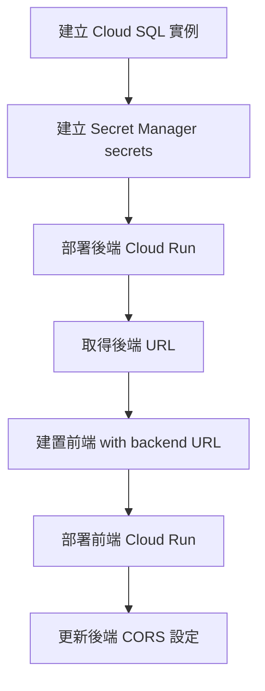

# 資料模型與配置規格

**功能**: Cloud Run 自動化部署
**日期**: 2025-11-07
**狀態**: 完成

本文件定義 Cloud Run 部署所需的環境變數、配置參數與資料模型。

---

## 1. Cloud SQL 資料庫配置

### 1.1 資料庫實例規格

| 參數 | 值 | 說明 |
|------|-----|------|
| **Instance ID** | `tpml-seat-tracker-db` | Cloud SQL 實例名稱 |
| **資料庫引擎** | PostgreSQL 15 | 與開發環境一致 |
| **機器類型** | `db-f1-micro` | 0.6GB RAM, 共享 CPU |
| **儲存類型** | SSD | 標準 SSD（較快） |
| **儲存大小** | 10GB | 初始配置，可自動擴展 |
| **IP 類型** | Public IP | 透過 Cloud SQL Connector 連線 |
| **區域** | `asia-east1` | 與 Cloud Run 同區域（減少延遲） |
| **備份** | 啟用自動備份 | 每日備份，保留 7 天 |
| **高可用性（HA）** | 停用 | 降低成本，可後續啟用 |
| **連線名稱格式** | `PROJECT_ID:REGION:INSTANCE_ID` | 例如 `three-birds-on-mountain:asia-east1:tpml-seat-tracker-db` |

### 1.2 資料庫使用者與權限

| 欄位 | 值 | 說明 |
|------|-----|------|
| **使用者名稱** | `tpml_user` | 應用程式資料庫使用者 |
| **認證方式** | Password 或 IAM | 建議使用 IAM（無需管理密碼） |
| **資料庫名稱** | `tpml_seat_tracker` | 主要資料庫 |
| **權限** | `CONNECT`, `CREATE`, `SELECT`, `INSERT`, `UPDATE`, `DELETE` | 應用程式所需權限 |

**IAM 認證設定**（建議）：
```sql
-- 在 Cloud SQL 中建立 IAM 使用者
CREATE ROLE "serviceaccount@PROJECT_ID.iam" WITH LOGIN;
GRANT ALL PRIVILEGES ON DATABASE tpml_seat_tracker TO "serviceaccount@PROJECT_ID.iam";
```

---

## 2. 後端 Cloud Run 服務配置

### 2.1 服務規格

| 參數 | 值 | 說明 |
|------|-----|------|
| **Service Name** | `tpml-backend` | Cloud Run 服務名稱 |
| **Region** | `asia-east1` | 台灣區域 |
| **CPU** | 1 vCPU | 標準配置 |
| **Memory** | 1Gi | 1GB RAM |
| **Min Instances** | 0 | 無流量時縮減至 0（節省成本） |
| **Max Instances** | 10 | 防止成本失控 |
| **Concurrency** | 80 | 每個 instance 同時處理 80 請求 |
| **Timeout** | 300s | 5 分鐘請求逾時 |
| **Port** | 8000 | FastAPI 監聽 port |
| **Ingress** | All | 允許公開存取（可設 `internal` 限內部） |
| **Allow Unauthenticated** | Yes（初期）| 可設為 No 增強安全性 |

### 2.2 環境變數

#### 必要環境變數

| 變數名稱 | 來源 | 範例值 | 說明 |
|----------|------|--------|------|
| `DATABASE_URL` | Secret Manager | `postgresql+asyncpg://user:pass@/dbname` | **不使用**（改用 Cloud SQL Connector） |
| `CLOUD_SQL_CONNECTION_NAME` | 環境變數 | `three-birds-on-mountain:asia-east1:tpml-seat-tracker-db` | Cloud SQL 連線名稱 |
| `DB_USER` | Secret Manager | `tpml_user` | 資料庫使用者名稱 |
| `DB_PASSWORD` | Secret Manager | `<secret>` | 資料庫密碼（或用 IAM 認證移除） |
| `DB_NAME` | 環境變數 | `tpml_seat_tracker` | 資料庫名稱 |
| `API_BASE_URL` | 環境變數 | `https://tpml-backend-xxx.run.app` | 後端公開 URL（部署後取得） |
| `LOG_LEVEL` | 環境變數 | `INFO` | 日誌等級 |

#### 選用環境變數

| 變數名稱 | 來源 | 範例值 | 說明 |
|----------|------|--------|------|
| `EXTERNAL_API_URL` | 環境變數 | `https://tpml.gov.taipei/api/seats` | 外部座位 API URL |
| `ENABLE_IAM_AUTH` | 環境變數 | `true` | 啟用 IAM 資料庫認證 |
| `CORS_ORIGINS` | 環境變數 | `https://tpml-frontend-xxx.run.app` | 允許的 CORS origin |

### 2.3 後端環境變數對應

**調整 `backend/src/config.py`**：
```python
from pydantic_settings import BaseSettings

class Settings(BaseSettings):
    # Cloud SQL 連線參數
    cloud_sql_connection_name: str  # 例如 PROJECT:REGION:INSTANCE
    db_user: str
    db_password: str | None = None  # IAM 認證時可為 None
    db_name: str
    enable_iam_auth: bool = False

    # API 設定
    api_base_url: str
    log_level: str = "INFO"

    # 外部 API
    external_api_url: str = "https://example.com/api/seats"

    # CORS
    cors_origins: str = "*"  # 可改為逗號分隔的 URL 清單

    model_config = SettingsConfigDict(
        env_file=".env",
        case_sensitive=False,
    )

settings = Settings()
```

---

## 3. 前端 Cloud Run 服務配置

### 3.1 服務規格

| 參數 | 值 | 說明 |
|------|-----|------|
| **Service Name** | `tpml-frontend` | Cloud Run 服務名稱 |
| **Region** | `asia-east1` | 台灣區域 |
| **CPU** | 0.5 vCPU | 靜態檔案夠用 |
| **Memory** | 512Mi | 512MB RAM |
| **Min Instances** | 0 | 無流量時縮減至 0 |
| **Max Instances** | 5 | Nginx 可處理高並行 |
| **Concurrency** | 80 | 靜態資源服務 |
| **Timeout** | 60s | 1 分鐘逾時 |
| **Port** | 80 | Nginx 預設 port |
| **Ingress** | All | 公開存取 |
| **Allow Unauthenticated** | Yes | 前端必須公開 |

### 3.2 建置時環境變數（Dockerfile ARG）

這些變數在**建置時**注入，不是執行時環境變數。

| 變數名稱 | 範例值 | 說明 |
|----------|--------|------|
| `VITE_API_BASE_URL` | `https://tpml-backend-xxx.run.app` | 後端 API URL（需先部署後端） |
| `VITE_MAPBOX_TOKEN` | `pk.ey...` | Mapbox 公開 token |

**注意事項**：
- ⚠️ 這些變數會編譯進 JavaScript bundle，任何人都可檢視
- ✅ Mapbox Token 應設為**公開 token**（有 URL referer 限制）
- ❌ **絕不**將私密資訊（資料庫密碼、API keys）注入前端

### 3.3 前端 Dockerfile 調整

**修改 `frontend/Dockerfile`**：
```dockerfile
FROM node:20-alpine AS builder
WORKDIR /app

# 建置時參數
ARG VITE_API_BASE_URL
ARG VITE_MAPBOX_TOKEN

# 轉為環境變數供 Vite 使用
ENV VITE_API_BASE_URL=$VITE_API_BASE_URL
ENV VITE_MAPBOX_TOKEN=$VITE_MAPBOX_TOKEN
ENV NODE_ENV=production

# 安裝依賴
COPY package.json package-lock.json* ./
RUN npm ci

# 建置
COPY . .
RUN npm run build

# Runtime stage
FROM nginx:1.27-alpine
WORKDIR /usr/share/nginx/html

COPY docker/nginx.conf /etc/nginx/conf.d/default.conf
COPY --from=builder /app/dist ./

EXPOSE 80
CMD ["nginx", "-g", "daemon off;"]
```

---

## 4. Secret Manager 配置

### 4.1 需建立的 Secrets

| Secret 名稱 | 值 | 使用者 | 說明 |
|------------|-----|---------|------|
| `database-password` | `<生成的強密碼>` | 後端 | Cloud SQL 密碼（或用 IAM 移除） |
| `mapbox-token` | `pk.ey...` | 前端建置 | Mapbox 公開 token |

### 4.2 Secret 建立指令

```bash
# 建立資料庫密碼 secret
echo -n "YOUR_STRONG_PASSWORD" | gcloud secrets create database-password \
  --replication-policy="automatic" \
  --data-file=-

# 建立 Mapbox token secret
echo -n "pk.eyJ1..." | gcloud secrets create mapbox-token \
  --replication-policy="automatic" \
  --data-file=-

# 授予 Cloud Run Service Account 存取權限
PROJECT_NUMBER=$(gcloud projects describe PROJECT_ID --format="value(projectNumber)")
SERVICE_ACCOUNT="${PROJECT_NUMBER}-compute@developer.gserviceaccount.com"

gcloud secrets add-iam-policy-binding database-password \
  --member="serviceAccount:${SERVICE_ACCOUNT}" \
  --role="roles/secretmanager.secretAccessor"

gcloud secrets add-iam-policy-binding mapbox-token \
  --member="serviceAccount:${SERVICE_ACCOUNT}" \
  --role="roles/secretmanager.secretAccessor"
```

---

## 5. 資料庫連線層實作

### 5.1 調整後的連線邏輯

**檔案**: `backend/src/database.py`（新建或調整現有檔案）

```python
from google.cloud.sql.connector import Connector
import sqlalchemy
from sqlalchemy.ext.asyncio import create_async_engine, AsyncSession
from sqlalchemy.orm import sessionmaker
from src.config import settings

# 初始化 Cloud SQL Connector
connector = Connector(refresh_strategy="lazy")

def getconn():
    """建立 Cloud SQL 連線"""
    conn = connector.connect(
        settings.cloud_sql_connection_name,
        "asyncpg",
        user=settings.db_user,
        password=settings.db_password if not settings.enable_iam_auth else None,
        db=settings.db_name,
        enable_iam_auth=settings.enable_iam_auth,
    )
    return conn

# 建立 SQLAlchemy 引擎
engine = create_async_engine(
    "postgresql+asyncpg://",
    creator=getconn,
    echo=settings.log_level == "DEBUG",
)

# 建立 Session factory
AsyncSessionLocal = sessionmaker(
    engine,
    class_=AsyncSession,
    expire_on_commit=False,
)

async def get_db():
    """FastAPI dependency: 取得資料庫 session"""
    async with AsyncSessionLocal() as session:
        yield session
```

### 5.2 FastAPI 整合

**調整 `backend/src/main.py`**：
```python
from fastapi import FastAPI, Depends
from sqlalchemy.ext.asyncio import AsyncSession
from src.database import get_db, engine, connector

app = FastAPI()

@app.on_event("startup")
async def startup():
    """應用程式啟動時的初始化"""
    # 測試資料庫連線
    async with engine.begin() as conn:
        await conn.run_sync(lambda sync_conn: sync_conn.execute("SELECT 1"))
    print("✅ Cloud SQL 連線成功")

@app.on_event("shutdown")
async def shutdown():
    """應用程式關閉時的清理"""
    await engine.dispose()
    connector.close()
    print("✅ Cloud SQL 連線已關閉")

@app.get("/health")
async def health_check(db: AsyncSession = Depends(get_db)):
    """健康檢查端點"""
    await db.execute("SELECT 1")
    return {"status": "healthy", "database": "connected"}
```

---

## 6. CORS 配置

### 6.1 後端 CORS 設定

**調整 `backend/src/main.py`**：
```python
from fastapi.middleware.cors import CORSMiddleware
from src.config import settings

# 解析 CORS origins（支援逗號分隔）
origins = settings.cors_origins.split(",") if settings.cors_origins != "*" else ["*"]

app.add_middleware(
    CORSMiddleware,
    allow_origins=origins,
    allow_credentials=True,
    allow_methods=["*"],
    allow_headers=["*"],
)
```

### 6.2 CORS 環境變數範例

**開發環境**：
```bash
CORS_ORIGINS="http://localhost:5173,http://localhost:3000"
```

**生產環境**：
```bash
CORS_ORIGINS="https://tpml-frontend-xxx.run.app"
```

---

## 7. 部署配置摘要

### 7.1 部署順序與依賴



### 7.2 環境變數對照表

| 服務 | 變數名稱 | 值來源 | 時機 |
|------|---------|--------|------|
| 後端 | `CLOUD_SQL_CONNECTION_NAME` | 直接設定 | 執行時 |
| 後端 | `DB_USER` | Secret Manager | 執行時 |
| 後端 | `DB_PASSWORD` | Secret Manager | 執行時 |
| 後端 | `DB_NAME` | 直接設定 | 執行時 |
| 後端 | `CORS_ORIGINS` | 直接設定 | 執行時 |
| 前端 | `VITE_API_BASE_URL` | Dockerfile ARG | 建置時 |
| 前端 | `VITE_MAPBOX_TOKEN` | Secret Manager → ARG | 建置時 |

---

## 8. 成本估算明細

| 項目 | 配置 | 月成本（USD） |
|------|------|--------------|
| Cloud SQL | db-f1-micro, Public IP, 10GB SSD, 7 天備份 | $15-20 |
| Cloud Run 後端 | 1 CPU, 1GB, min=0, 假設 10 萬次請求/月 | $5-10 |
| Cloud Run 前端 | 0.5 CPU, 512MB, min=0, 假設 10 萬次請求/月 | $2-5 |
| Secret Manager | 2 secrets, 低存取頻率 | < $1 |
| 網路流量 | 估計 10GB 出口流量 | $1-2 |
| **總計** | - | **$23-38** |

**成本最佳化建議**：
- ✅ min-instances=0（無流量時不收費）
- ✅ 使用 Public IP（省 VPC Connector ~$30/月）
- ✅ db-f1-micro（最小可用配置）
- ⚠️ 監控 Cloud SQL 儲存使用量（10GB 超過後自動擴展會增加成本）

---

## 9. 安全性檢查清單

- [x] 密碼透過 Secret Manager 管理（不出現在程式碼或 shell history）
- [x] Cloud SQL 使用 TLS 加密連線（Cloud SQL Connector 自動處理）
- [x] 考慮啟用 IAM 資料庫認證（移除密碼）
- [x] 前端僅注入公開 token（Mapbox public token with referer restrictions）
- [x] CORS 設定僅允許前端 origin（避免 `*`）
- [x] Cloud Run 預設提供 HTTPS（無需額外配置）
- [ ] 考慮設定 Cloud Armor（DDoS 防護，範疇外）
- [ ] 考慮設定 Cloud CDN（前端加速，範疇外）

---

## 附錄 A: 環境變數範本

### 後端 `.env` 範本（本地開發用）
```env
CLOUD_SQL_CONNECTION_NAME=three-birds-on-mountain:asia-east1:tpml-seat-tracker-db
DB_USER=tpml_user
DB_PASSWORD=local_dev_password
DB_NAME=tpml_seat_tracker
ENABLE_IAM_AUTH=false

API_BASE_URL=http://localhost:8000
LOG_LEVEL=DEBUG
EXTERNAL_API_URL=https://example.com/api/seats
CORS_ORIGINS=http://localhost:5173
```

### 前端 `.env` 範本（本地開發用）
```env
VITE_API_BASE_URL=http://localhost:8000
VITE_MAPBOX_TOKEN=pk.eyJ1...
```

---

**文件版本**: 1.0
**最後更新**: 2025-11-07
