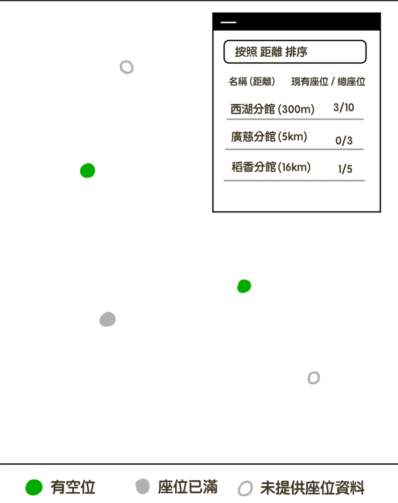

## 🖼️ 主畫面結構

### 1️⃣ 地圖區域

- **地圖底層**：使用開源底圖（MapLibre + MapTiler / OpenStreetMap）
- **顯示內容**：
    - 每個圖書館以「點（Marker）」表示。
    - 點擊地圖上的圖書館點，底部會彈出簡短資訊框。

### 🎯 點樣式說明

| 狀態 | 顏色 / 樣式 | 說明 |
| --- | --- | --- |
| 有空位 | 🟢 綠點 | 尚有座位可使用 |
| 座位已滿 | ⚫ 灰點 | 無可用座位 |
| 未提供座位資料 | ⚪ 白色外框灰圈 | API 未回傳座位數資訊 |

> Footer 區塊會以圖例說明上述三種顏色含意。
> 

---

### 2️⃣ 底部資訊框（Info Footer）

- 固定在地圖底部。
- 顯示：
    - 各顏色點代表意義（圖例）。
    - 當點擊地圖上的點時，底部會顯示：
        - 圖書館名稱
        - 「查看詳細資訊」按鈕

---

### 3️⃣ 右上角圖書館列表視窗（可收合）

### 📦 預設行為

- 疊在地圖右上角（z-index 較高）。
- 視窗左上角有一個「減號（–）」圖示：
    - 點擊「–」→ 收合視窗，只顯示一個「加號（＋）」按鈕。
    - 點擊「＋」→ 展開視窗。

### 📋 展開後內容

- **Dropdown 排序選單**
    - 可選擇排序方式：
        - ➤ 依「距離」排序（由近到遠）
        - ➤ 依「座位數」排序（由多到少）
- **圖書館列表**
    - 每列顯示：
        - 名稱
        - 「現有座位 / 總座位」
            
            e.g. `45 / 80`
            
    - 點擊列表中某個圖書館 → 顯示詳細資訊頁。

---

### 4️⃣ 詳細資訊視窗（Library Detail）

- 顯示內容：
    
    
    | 項目 | 說明 |
    | --- | --- |
    | 名稱 | 圖書館全名 |
    | 地址 | 附「開啟 Google 導航」按鈕（`maps://` 或 `https://www.google.com/maps` 連結） |
    | 電話 | 可直接撥號 |
    | 營業時間 | e.g. `週一至週五 09:00–21:00` |
    | 距離 | 根據使用者 GPS 計算 |
    | 座位資訊 | e.g. `目前 52 / 總座位 120` |
- 頁面上方有「X」按鈕：
    - 點擊後關閉詳細資訊，返回地圖畫面。

---

## 📲 互動流程簡圖

```
使用者進入頁面
   ↓
載入地圖與圖書館標記
   ↓
查看地圖上標點顏色（可用/滿座/未知）
   ↓
點擊某點 → 下方出現簡訊息 + 「查看詳細」
   ↓
按下「查看詳細」 → 顯示圖書館詳情
   ↓
按「X」關閉 → 回到地圖
   ↓
可透過右上列表切換排序、瀏覽其他館別
```
